# CLAUDE.md

> **Last Updated:** 2026-07-10
> **Documentation Version:** 1.5.0

This file provides guidance to Claude Code (claude.ai/code) when working with code in this repository.

## Changelog

| Date | Version | Changes |
|------|---------|---------|
| 2026-07-10 | 1.5.0 | Rebrand to **Cobalt Skymap**: updated display name across UI/docs/metadata, renamed `SkyMapLogo`→`CobaltSkymapLogo`, aligned repo references to ElementAstro/cobalt-skymap; storage keys/paths and bundle identifier (`com.skymap.desktop`) intentionally preserved for data compatibility |
| 2026-02-28 | 1.4.0 | Comprehensive sync: added Rust mount module, knowledge UI, icons component, 7 new stores, 19+ new hooks, astronomy engine/horizon/object-resolver subdirs, services daily-knowledge/map-providers/search subdirs, tauri mount/geolocation/map-keys APIs; fixed port references; removed stale llmdoc reference |
| 2026-02-13 | 1.3.0 | Major update: added mount-safety/simulator modules, event-sources-store, updater-store, use-object-actions/use-in-view hooks; removed titlebar/window-controls; updated module descriptions |
| 2026-02-11 | 1.2.0 | Added llmdoc/index.md with comprehensive documentation links; updated scan coverage to 98%; added logger module documentation |
| 2026-02-01 | 1.1.0 | Added tauri-api module documentation; updated scan coverage |
| 2025-01-31 | 1.0.0 | Initial comprehensive documentation with module structure diagram |

---

## Project Overview

A desktop star map and astronomy planning application built with **Next.js 16** + **Tauri 2.9**. The app integrates with Stellarium Web Engine for sky visualization and provides tools for observation planning, equipment management, and astronomical calculations.

**Tech Stack:**

- **Frontend:** Next.js 16, React 19, TypeScript, Tailwind CSS v4
- **Desktop:** Tauri 2.9 (Rust backend)
- **UI:** shadcn/ui, Radix UI, Lucide icons
- **State:** Zustand stores
- **i18n:** next-intl (English/Chinese)

---

## Module Structure

```mermaid
graph TD
    A["(root) cobalt-skymap"] --> B["components"];
    A --> C["lib"];
    A --> D["src-tauri"];
    A --> E["i18n"];
    A --> F["tests"];

    B --> B1["starmap"];
    B --> B2["ui"];
    B --> B3["providers"];
    B --> B4["common"];
    B --> B5["landing"];
    B --> B6["icons"];

    C --> C1["astronomy"];
    C --> C2["stores"];
    C --> C3["services"];
    C --> C4["core"];
    C --> C5["catalogs"];
    C --> C6["tauri"];
    C --> C7["logger"];
    C --> C8["storage"];
    C --> C9["offline"];
    C --> C10["hooks"];
    C --> C11["translations"];
    C --> C12["aladin"];
    C --> C13["data"];
    C --> C14["feedback"];
    C --> C15["constants"];
    C --> C16["plate-solving"];
    C --> C17["security"];
    C --> C18["utils"];

    D --> D1["astronomy"];
    D --> D2["data"];
    D --> D3["cache"];
    D --> D4["network"];
    D --> D5["platform"];
    D --> D6["mount"];

    E --> E1["messages"];
    F --> F1["e2e"];

    click B1 "./components/starmap/CLAUDE.md" "View starmap module documentation"
    click C1 "./lib/astronomy/CLAUDE.md" "View astronomy module documentation"
    click C2 "./lib/stores/CLAUDE.md" "View stores module documentation"
    click C6 "./lib/tauri/CLAUDE.md" "View tauri-api module documentation"
    click C7 "./lib/logger/CLAUDE.md" "View logger module documentation"
    click D1 "./src-tauri/src/astronomy/CLAUDE.md" "View Rust astronomy module documentation"
    click D2 "./src-tauri/src/data/CLAUDE.md" "View Rust data module documentation"
    click D4 "./src-tauri/src/network/CLAUDE.md" "View Rust network module documentation"
    click D3 "./src-tauri/src/cache/CLAUDE.md" "View Rust cache module documentation"
    click D5 "./src-tauri/src/platform/CLAUDE.md" "View Rust platform module documentation"
    click E1 "./i18n/CLAUDE.md" "View i18n module documentation"
    click F1 "./tests/e2e/CLAUDE.md" "View E2E test documentation"
```



---

## Module Index

| Module | Path | Language | Description | Documentation |
|--------|------|----------|-------------|---------------|
| **starmap-ui** | `components/starmap/` | TSX | Star map UI components (core, overlays, planning, objects, management) | [CLAUDE.md](./components/starmap/CLAUDE.md) |
| **tauri-api** | `lib/tauri/` | TS | TypeScript wrappers for Tauri IPC commands | [CLAUDE.md](./lib/tauri/CLAUDE.md) |
| **astronomy-calculations** | `lib/astronomy/` | TS | Pure astronomical calculations (coordinates, time, visibility, mount-safety) | [CLAUDE.md](./lib/astronomy/CLAUDE.md) |
| **state-management** | `lib/stores/` | TS | Zustand stores (settings, equipment, targets, markers, event-sources, updater) | [CLAUDE.md](./lib/stores/CLAUDE.md) |
| **logger** | `lib/logger/` | TS | Unified logging system with multiple transports | [CLAUDE.md](./lib/logger/CLAUDE.md) |
| **frontend-services** | `lib/services/` | TS | Service layer for external APIs | [CLAUDE.md](./lib/services/CLAUDE.md) |
| **catalogs** | `lib/catalogs/` | TS | Astronomical catalog data and types | [CLAUDE.md](./lib/catalogs/CLAUDE.md) |
| **rust-backend** | `src-tauri/src/` | Rust | Tauri backend entry point and module orchestration | [CLAUDE.md](./src-tauri/src/CLAUDE.md) |
| **rust-astronomy** | `src-tauri/src/astronomy/` | Rust | Astronomical calculations in Rust | [CLAUDE.md](./src-tauri/src/astronomy/CLAUDE.md) |
| **rust-storage** | `src-tauri/src/data/` | Rust | JSON storage for equipment, locations, targets, markers | [CLAUDE.md](./src-tauri/src/data/CLAUDE.md) |
| **rust-network** | `src-tauri/src/network/` | Rust | HTTP client with security and rate limiting | [CLAUDE.md](./src-tauri/src/network/CLAUDE.md) |
| **rust-cache** | `src-tauri/src/cache/` | Rust | Offline tile caching and unified cache | [CLAUDE.md](./src-tauri/src/cache/CLAUDE.md) |
| **rust-platform** | `src-tauri/src/platform/` | Rust | Desktop-only features (settings, updater, plate solver) | [CLAUDE.md](./src-tauri/src/platform/CLAUDE.md) |
| **rust-mount** | `src-tauri/src/mount/` | Rust | ALPACA mount client, simulator, commands | — |
| **storage** | `lib/storage/` | TS | Storage abstraction layer (Tauri/Web adapters, Zustand bridge) | — |
| **hooks** | `lib/hooks/` | TS | Custom React hooks (37+ hooks, aladin/, stellarium/ subdirs) | — |
| **data** | `lib/data/` | TS | Curated data (daily knowledge content) | — |
| **feedback** | `lib/feedback/` | TS | Feedback utilities | — |
| **constants** | `lib/constants/` | TS | App constants (equipment presets, shortcuts, onboarding, etc.) | — |
| **aladin** | `lib/aladin/` | TS | Aladin Lite compatibility layer | — |
| **plate-solving** | `lib/plate-solving/` | TS | Astrometry API and FITS parser | — |
| **security** | `lib/security/` | TS | Frontend security utilities | — |
| **utils** | `lib/utils/` | TS | Map utilities, observer location, scroll animation | — |
| **icons** | `components/icons/` | TSX | Brand icons, Cobalt Skymap logo, Stellarium/Zustand icons | — |
| **internationalization** | `i18n/` | JSON | English/Chinese translations | [CLAUDE.md](./i18n/CLAUDE.md) |
| **e2e-tests** | `tests/e2e/` | TS | Playwright end-to-end tests | [CLAUDE.md](./tests/e2e/CLAUDE.md) |

---

## Development Commands

```bash
# Frontend
pnpm dev                    # Start Next.js dev server (localhost:1420)
pnpm build                  # Build for production (outputs to out/)
pnpm lint                   # ESLint

# Desktop App (Tauri)
pnpm tauri dev              # Run desktop app with hot-reload
pnpm tauri build            # Build production desktop app

# Testing (Jest - Unit/Integration)
pnpm test                   # Run all tests
pnpm test:watch             # Watch mode
pnpm test:coverage          # With coverage (thresholds: 50% branches, 35% functions, 60% lines/statements)
pnpm test -- path/to/file   # Run specific test file

# Testing (Playwright - E2E)
pnpm exec playwright test                    # Run all E2E tests
pnpm exec playwright test --project=chromium # Single browser
pnpm exec playwright test tests/e2e/starmap/ # Specific directory

# Type checking
pnpm exec tsc --noEmit      # Check TypeScript without emitting

# Add shadcn/ui components
pnpm dlx shadcn@latest add [component-name]
```

**Important Build Note:** For Tauri production builds, Next.js must use static export mode. Ensure `output: "export"` is set in `next.config.ts` as `tauri.conf.json` expects the `out/` directory.

---

## Architecture

### Frontend-Backend Communication

The app uses Tauri's IPC for frontend-backend communication:

1. **Rust commands** are defined in `src-tauri/src/*.rs` modules (equipment, locations, astronomy, etc.)
2. **TypeScript APIs** in `lib/tauri/` wrap Tauri's `invoke()` calls with type safety
3. **Zustand stores** in `lib/stores/` manage client state and sync with Rust backend

```
React Component --> Zustand Store --> lib/tauri/*-api.ts --> Tauri invoke() --> Rust command
```

### Key Directories

**`lib/tauri/`** - Tauri IPC wrappers:
- `api.ts` - Generic invoke wrapper
- `storage-api.ts` - Storage operations
- `astronomy-api.ts` - Astronomy calculations
- `events-api.ts` - Astro events
- `target-list-api.ts` - Target list management
- `markers-api.ts` - Sky markers
- `http-api.ts` - HTTP client
- `cache-api.ts`, `unified-cache-api.ts` - Cache management
- `updater-api.ts`, `updater-hooks.ts` - Auto-update
- `app-control-api.ts` - App control
- `plate-solver-api.ts` - Plate solving
- `mount-api.ts` - ALPACA mount control
- `geolocation-api.ts` - Geolocation
- `map-keys-api.ts` - Map tile API keys
- `path-config-api.ts` - Path configuration
- `TauriSyncProvider.tsx` - Zustand sync provider

**`lib/astronomy/`** - Pure astronomical calculations (no side effects):
- `coordinates/` - RA/Dec, Alt/Az, Galactic coordinate conversions
- `time/` - Julian date, sidereal time calculations
- `celestial/` - Sun, Moon position calculations
- `visibility/` - Target visibility, circumpolar calculations
- `twilight/` - Twilight times (civil, nautical, astronomical)
- `imaging/` - Exposure and imaging feasibility calculations
- `engine/` - Unified Tauri-first backend with `astronomy-engine` fallback
- `horizon/` - Custom horizon profile support
- `object-resolver/` - Object name parsing (catalog, minor body, coordinate)
- `data/` - EOP baseline data
- `mount-safety.ts` - GEM mount safety checks (meridian flip, hour angle limits, pier collision)
- `mount-simulator.ts` - Sequence simulation for mount safety analysis
- `frames.ts`, `pipeline.ts`, `time-scales.ts` - Coordinate frame contracts and unified transform pipeline
- `session-scheduler.ts`, `session-scheduler-v2.ts` - Observation session scheduling
- `plan-exporter.ts` - Session plan export
- `fov-calculations.ts`, `fov-utils.ts` - Field of view utilities
- `sky-quality.ts` - Sky quality/Bortle estimation
- `navigation.ts`, `starmap-utils.ts` - Star map navigation helpers
- `ocular-utils.ts`, `exposure-utils.ts`, `event-utils.ts`, `object-type-utils.ts` - Domain utilities

**`lib/stores/`** - Zustand state management:
- `settings-store` - App preferences and UI settings
- `equipment-store` - Telescopes, cameras, eyepieces with built-in presets
- `target-list-store` - Observation targets
- `marker-store` - Custom sky markers
- `onboarding-store` - First-run experience state
- `bookmarks-store` - View bookmarks
- `mount-store` - Telescope mount state
- `framing-store` - Camera framing state
- `plate-solver-store` - Plate solving state
- `stellarium-store` - Stellarium settings
- `satellite-store` - Satellite tracking state
- `search-store` - Search state
- `theme-store` - Theme preference
- `favorites-store` - Favorite objects
- `setup-wizard-store` - Setup wizard state
- `log-store` - Application logs
- `event-sources-store` - Astronomical event source configuration
- `updater-store` - Application update state management
- `aladin-store` - Aladin Lite viewer state
- `daily-knowledge-store` - Daily astronomy knowledge state
- `feedback-store` - User feedback state
- `onboarding-bridge-store` - Onboarding bridge/adapter state
- `planning-ui-store` - Planning panel UI state
- `session-plan-store` - Observation session plan state
- `web-location-store` - Web-only location state

**`lib/hooks/`** - Custom React hooks (37+ hooks):
- `use-geolocation` - Geolocation with fallback
- `use-object-search` - Object search functionality
- `use-object-actions` - Shared slew/add-to-list actions for object panels
- `use-in-view` - Intersection Observer for scroll-triggered animations
- `use-tonight-recommendations` - Tonight's best targets
- `use-target-planner` - Target scheduling
- `use-http-client` - Tauri HTTP integration
- `use-animation-frame` - Animation loop management
- `use-coordinate-projection` - Sky to screen coordinate projection
- `use-keyboard-shortcuts` - Keyboard shortcut handling
- `use-navigation-history` - View history management
- `use-window-controls` - Desktop window controls
- `use-system-stats` - FPS, memory, online status
- `use-night-mode` - Night mode CSS effects
- `use-mount-overlay` - Mount control overlay
- `use-object-astro-data` - Astronomical data for objects
- `use-time-controls` - Stellarium time controls
- `use-adaptive-position` - Adaptive UI positioning
- `use-cache-init` - Cache initialization
- `use-camera` - Camera control
- `use-carousel` - Carousel interaction
- `use-celestial-name` - Celestial object name resolution
- `use-device-orientation` - Device orientation sensor
- `use-equipment-fov-props` - Equipment FOV property computation
- `use-focus-trap` - Focus trap for accessibility
- `use-is-client` - Client-side rendering guard
- `use-mount-polling` - Mount status polling
- `use-observing-conditions` - Observing conditions assessment
- `use-ocular-simulation` - Eyepiece simulation
- `use-orientation` - Device orientation
- `use-prefers-reduced-motion` - Reduced motion preference
- `use-select-target` - Target selection
- `use-star-field` - Star field animation
- `use-target-list-actions` - Target list CRUD actions
- `use-tour-position` - Onboarding tour tooltip positioning
- `use-window-state` - Window state management
- `stellarium/*` - Stellarium canvas hooks (click-coordinates, fov-overlay, marker-sync, selection, sky-culture, etc.)
- `aladin/*` - Aladin Lite hooks (catalogs, events, FITS, layers, loader, MOC, overlays, settings-sync)

**`lib/logger/`** - Unified logging system:
- `log-manager.ts` - Central log manager with singleton
- `transports/console-transport.ts` - Browser console output
- `transports/memory-transport.ts` - In-memory storage for UI
- `transports/tauri-transport.ts` - Backend bridge for Rust logs
- `createLogger()` - Factory function for module-specific loggers

**`components/starmap/`** - Star map UI components:
- `canvas/` - Stellarium Web Engine canvas wrapper
- `view/` - Main sky view component
- `search/` - Object search and advanced search
- `settings/` - Settings panels and dialogs (including event-sources-settings)
- `controls/` - Zoom, navigation history, bookmarks, keyboard shortcuts
- `time/` - Time control and clock display
- `overlays/` - FOV simulator, satellite tracker, ocular simulator, sky markers
- `planning/` - Altitude charts, exposure calculator, session planning, mount-safety-simulator, event-detail-dialog
- `objects/` - Object info panels, detail drawers, image galleries
- `management/` - Equipment, location, cache, and data managers
- `dialogs/` - About, credits, keyboard shortcuts dialogs
- `onboarding/` - Welcome dialog and tour components
- `setup-wizard/` - First-time setup wizard
- `knowledge/` - Daily astronomy knowledge (button, dialog, startup coordinator)
- `plate-solving/` - Image capture and plate solving
- `feedback/` - Loading skeletons and splash screens
- `mount/` - Telescope mount control
- `map/` - Leaflet-based location picker

**`src-tauri/src/`** - Rust backend modules:
- `storage.rs` - Generic JSON storage system
- `equipment.rs`, `locations.rs` - Equipment and location management
- `astronomy/calculations.rs` - Coordinate transforms, visibility calculations
- `astronomy/events.rs` - Moon phases, meteor showers, astronomical events
- `cache/offline.rs` - Tile caching for sky surveys
- `cache/unified.rs` - General-purpose network cache
- `network/http_client.rs` - HTTP client with retries and progress
- `network/security.rs` - URL validation and SSRF protection
- `network/rate_limiter.rs` - Request rate limiting
- `platform/app_settings.rs` - App settings persistence
- `platform/app_control.rs` - App restart, quit, reload
- `platform/updater.rs` - Auto-update functionality
- `platform/plate_solver.rs` - Plate solving integration
- `mount/alpaca_client.rs` - ALPACA telescope mount protocol client
- `mount/commands.rs` - Mount Tauri commands
- `mount/simulator.rs` - Mount simulator for testing
- `mount/types.rs` - Mount type definitions
- `observation_log.rs` - Observation logging and history
- `target_list.rs`, `target_io.rs` - Target list management and import/export
- `markers.rs` - Custom sky marker persistence

### Data Storage

- User data stored in platform-specific app data directory (`skymap/stores/`)
- Rust `storage.rs` provides generic JSON store operations
- Frontend syncs state via `TauriSyncProvider` component
- Known stores: `starmap-target-list`, `starmap-markers`, `starmap-settings`, `starmap-equipment`, `starmap-onboarding`, `starmap-event-sources`, `starmap-feedback`, `starmap-daily-knowledge`, `theme-customization`, `skymap-offline`, `skymap-locale`

### Internationalization

- Translations in `i18n/messages/{en,zh}.json`
- `next-intl` for i18n with `lib/i18n/locale-store.ts` for persistence
- Use `useTranslations()` hook in components

---

## Path Aliases

```typescript
@/components  --> components/
@/lib         --> lib/
@/ui          --> components/ui/
@/hooks       --> hooks/
@/utils       --> lib/utils.ts
```

---

## Testing Conventions

- Test files: `__tests__/*.test.ts(x)` or `*.test.ts(x)`
- Uses Jest with React Testing Library
- E2E tests in `tests/e2e/` using Playwright
- Mock Tauri APIs in tests (see `__mocks__/` directory)
- Coverage reports output to `coverage/`

### Coverage Thresholds

- Branches: 50%
- Functions: 35%
- Lines: 60%
- Statements: 60%

---

## Component Patterns

- Use `cn()` from `@/lib/utils` to merge Tailwind classes: `cn("base", conditional && "conditional", className)`
- Prefer composition with `asChild` for polymorphic components (Button as Link, etc.)
- Dark mode via class-based strategy (apply `.dark` class to parent)

---

## Security Features

- **Rate Limiting** - Sliding window algorithm prevents API abuse
- **Input Validation** - Size limits on JSON, CSV, and tile data
- **SSRF Protection** - URL validation blocks private IPs and dangerous protocols
- **Storage Security** - Path sandboxing prevents path traversal attacks

See `src-tauri/src/network/security.rs` for implementation details.

---

## AI Usage Guidelines

### When Working With This Codebase

1. **Respect the module structure** - Keep changes within the appropriate module boundaries
2. **Follow the data flow** - Understand how data flows between frontend stores and Rust backend via Tauri IPC
3. **Write tests** - Add tests for new features, following the existing test patterns
4. **Update documentation** - Keep module-level CLAUDE.md files in sync with code changes
5. **Use the logger** - Replace `console.*` calls with `createLogger('module-name')`

### Common Tasks

| Task | Key Files |
|------|-----------|
| Add new UI component | `components/starmap/[category]/` |
| Add new setting | `lib/stores/settings-store.ts`, `components/starmap/settings/` |
| Add new calculation | `lib/astronomy/` or `src-tauri/src/astronomy/` |
| Add new Tauri command | `src-tauri/src/[module].rs`, `lib/tauri/[module]-api.ts` |
| Add translations | `i18n/messages/en.json`, `i18n/messages/zh.json` |
| Add logging | `lib/logger/index.ts` (use `createLogger()`) |
| Add mount safety checks | `lib/astronomy/mount-safety.ts`, `lib/astronomy/mount-simulator.ts` |
| Add mount control | `src-tauri/src/mount/`, `lib/tauri/mount-api.ts`, `components/starmap/mount/` |
| Add event source config | `lib/stores/event-sources-store.ts`, `components/starmap/settings/event-sources-settings.tsx` |
| Add daily knowledge | `lib/data/daily-knowledge-curated.ts`, `lib/stores/daily-knowledge-store.ts`, `components/starmap/knowledge/` |

---

## Scan Coverage

- **Total Files:** ~560
- **Scanned Files:** ~550
- **Coverage:** 98%
- **Ignored:** node_modules, .git, build artifacts

### Known Gaps

- `src-tauri/src/cache/` - No unit tests yet
- `src-tauri/src/platform/` - No unit tests yet
- `src-tauri/src/mount/` - No CLAUDE.md yet
- Smaller utility modules (lib/storage, lib/offline, lib/hooks, lib/data, lib/feedback, lib/constants, lib/aladin, lib/utils) - No module-level CLAUDE.md

### Recent Changes (2026-02-28)

**New Modules (since 2026-02-13):**
- `src-tauri/src/mount/` - ALPACA mount client, simulator, types, commands
- `components/starmap/knowledge/` - Daily astronomy knowledge UI
- `lib/data/daily-knowledge-curated.ts` - Curated daily knowledge content
- `lib/services/daily-knowledge/` - Daily knowledge service
- `lib/services/map-providers/` - Map tile provider configuration
- `lib/services/search/` - Search service abstraction
- `lib/stores/aladin-store.ts` - Aladin Lite viewer state
- `lib/stores/daily-knowledge-store.ts` - Daily knowledge state
- `lib/stores/feedback-store.ts` - User feedback state
- `lib/stores/onboarding-bridge-store.ts` - Onboarding bridge
- `lib/stores/planning-ui-store.ts` - Planning panel UI state
- `lib/stores/session-plan-store.ts` - Session plan state
- `lib/stores/web-location-store.ts` - Web-only location state
- `lib/tauri/mount-api.ts` - Mount control API
- `lib/tauri/geolocation-api.ts` - Geolocation API
- `lib/tauri/map-keys-api.ts` - Map keys API
- `lib/tauri/path-config-api.ts` - Path config API
- `lib/hooks/aladin/*` - Aladin Lite hooks (8 hooks)
- 19+ new hooks in `lib/hooks/`

**Previous Changes (2026-02-13):**
- `lib/astronomy/mount-safety.ts` - GEM mount safety configuration and checks
- `lib/astronomy/mount-simulator.ts` - Sequence simulation for mount safety
- `lib/stores/event-sources-store.ts` - Event source configuration management
- `lib/stores/updater-store.ts` - Application update state management
- `components/starmap/planning/mount-safety-simulator.tsx` - Mount safety UI
- `components/starmap/planning/event-detail-dialog.tsx` - Event detail display
- `components/starmap/settings/event-sources-settings.tsx` - Event source configuration UI

---

## Related Files

- [package.json](./package.json) - Frontend dependencies and scripts
- [src-tauri/Cargo.toml](./src-tauri/Cargo.toml) - Rust dependencies
- [next.config.ts](./next.config.ts) - Next.js configuration
- [jest.config.ts](./jest.config.ts) - Jest test configuration
- [playwright.config.ts](./playwright.config.ts) - Playwright E2E configuration
- [docs/](./docs/) - MkDocs-based developer and user documentation
