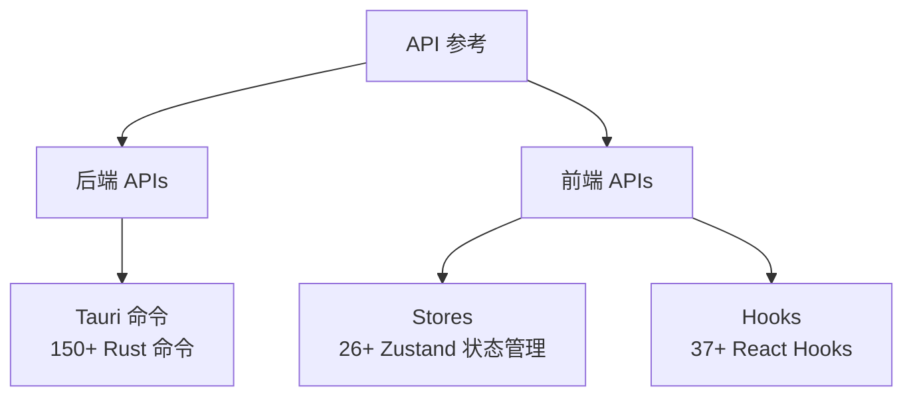

# API 参考文档

SkyMap 的 API 参考文档，包括前端和后端接口说明。

## 文档结构

## 后端 APIs

### [Tauri 命令 API](backend-apis/tauri-commands.md)

后端 Rust 代码通过 Tauri 提供给前端的所有命令接口。

- **platform::*** — 平台功能（应用控制、更新、天文定位、解板、密钥保险箱）
- **network::*** — HTTP 客户端（请求、下载、进度）
- **cache::*** — 缓存管理（离线瓦片、统一缓存）
- **astronomy::*** — 天文计算（坐标转换、可见性、事件）
- **data::*** — 数据持久化（存储、设备、目标、标记）
- **mount::*** — 赤道仪控制（ALPACA 连接、slew、同步）

## 前端 APIs

### [Zustand Stores API](frontend-apis/stores.md)

应用的 React 状态管理，使用 Zustand 实现。

- 核心 Stores: `stellarium-store`, `settings-store`, `equipment-store`, `theme-store`
- 数据 Stores: `target-list-store`, `marker-store`, `bookmarks-store`, `favorites-store`, `satellite-store`
- 规划 Stores: `session-plan-store`, `planning-ui-store`, `observation-log-store`
- 赤道仪 Stores: `mount-store`, `framing-store`
- UI Stores: `onboarding-store`, `updater-store`, `log-store`, `daily-knowledge-store`, `aladin-store`
- 其他 Stores: `event-sources-store`, `plate-solver-store`, `search-store`, `setup-wizard-store`, `feedback-store`, `web-location-store`

### [React Hooks API](frontend-apis/hooks.md)

自定义 React Hooks，封装常用业务逻辑。

- 设备 Hooks: `useGeolocation`, `useDeviceOrientation`, `useSystemStats`
- 搜索 Hooks: `useObjectSearch`, `useCelestialName`, `useObjectActions`
- 规划 Hooks: `useTonightRecommendations`, `useTargetPlanner`, `useObservingConditions`
- 赤道仪 Hooks: `useMountPolling`, `useMountOverlay`
- 引擎 Hooks: Aladin 系列（`useAladinLoader`, `useAladinCatalogs` 等）、Stellarium 系列（`useStellariumSelection`, `useStellariumFovOverlay` 等）
- 其他 Hooks: HTTP、导航、动画、更新、键盘快捷键等

## 快速导航

| 需求 | 查看文档 |
|------|----------|
| 调用 Rust 命令 | [Tauri 命令 API](backend-apis/tauri-commands.md) |
| 管理应用状态 | [Stores API](frontend-apis/stores.md) |
| 使用自定义 Hook | [Hooks API](frontend-apis/hooks.md) |
| 后端模块结构 | [Rust 后端文档](../../../src-tauri/src/CLAUDE.md) |

## 相关文档

- [数据流设计](../architecture/data-flow.md)
- [组件开发](../frontend-development/react-components.md)
