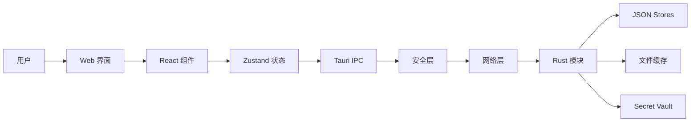

# 架构设计概览

本章节详细介绍 SkyMap 的系统架构设计。

## 架构文档

- **[系统架构](overview.md)** — 整体系统架构（含详细架构图）
- **[前端架构](frontend-architecture.md)** — Next.js + React 前端架构
- **[后端架构](backend-architecture.md)** — Tauri + Rust 后端架构
- **[数据流](data-flow.md)** — 前后端数据流设计

## 架构原则

### 设计理念

- **模块化**：清晰的模块边界
- **可维护性**：易于理解和修改
- **可扩展性**：方便添加新功能
- **性能**：优化渲染和计算性能
- **安全**：纵深防御策略

### 技术选型

前端采用现代 Web 技术栈，后端使用高性能的 Rust：

- **React 19**：最新的 UI 库
- **Next.js 16**：强大的 React 框架（App Router）
- **Tauri 2.9**：轻量级桌面应用框架
- **Rust**：系统级性能和安全性
- **Zustand**：轻量级状态管理

## 架构图总览

快速了解系统架构：[系统架构](overview.md)
