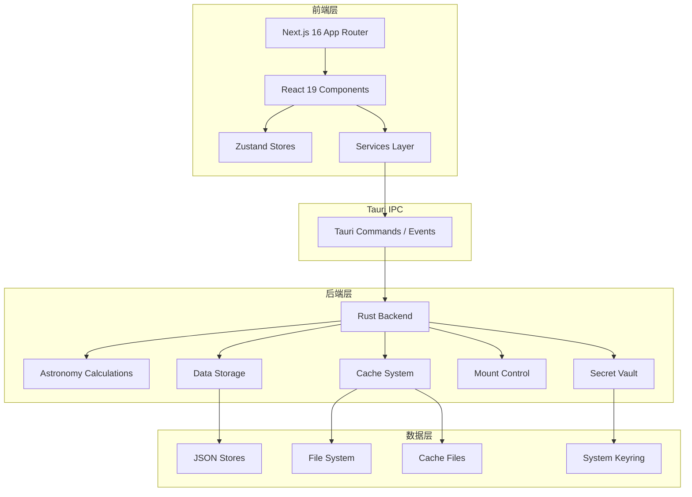
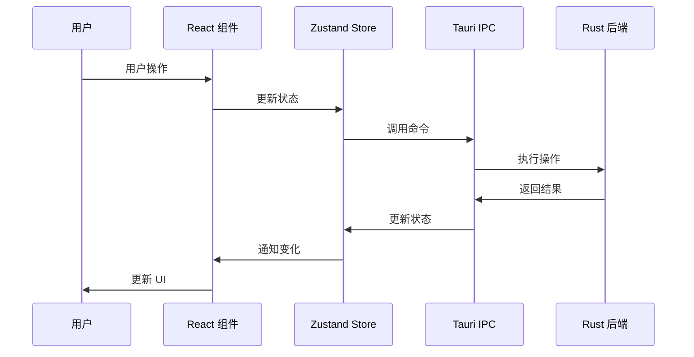

# 开发指南

欢迎来到 SkyMap 开发指南！本章节面向希望参与开发或扩展应用功能的开发者。

## 章节内容

### 架构设计

了解应用的系统架构：

- **[架构概览](architecture/index.md)** — 架构设计概述
- **[系统架构](architecture/overview.md)** — 整体系统架构（含架构图）
- **[前端架构](architecture/frontend-architecture.md)** — Next.js + React 前端架构
- **[后端架构](architecture/backend-architecture.md)** — Tauri + Rust 后端架构
- **[数据流](architecture/data-flow.md)** — 前后端数据流设计

### 开发环境

搭建开发环境：

- **[环境概览](development-environment/index.md)** — 开发环境介绍
- **[前置要求](development-environment/prerequisites.md)** — 必需的软件和工具
- **[环境搭建](development-environment/setup.md)** — 详细的环境配置步骤

### 项目结构

了解项目组织：

- **[结构概览](project-structure/index.md)** — 项目结构概述
- **[目录布局](project-structure/directory-layout.md)** — 详细的目录说明

### 核心模块

深入核心模块：

- **[模块概览](core-modules/index.md)** — 核心模块介绍
- **[星图核心](core-modules/starmap-core.md)** — 星图渲染核心
- **[天文计算](core-modules/astronomy-engine.md)** — 天文计算引擎
- **[赤道仪控制](core-modules/mount-control.md)** — ALPACA 赤道仪客户端
- **[解板系统](core-modules/plate-solving.md)** — 在线 Plate Solving 工作流

### API 参考

查看 API 文档：

- **[API 概览](apis/index.md)** — API 文档导航
- **[前端 API](apis/frontend-apis/index.md)** — 前端 API 文档
  - **[Stores](apis/frontend-apis/stores.md)** — Zustand Stores API
  - **[Hooks](apis/frontend-apis/hooks.md)** — React Hooks API
- **[后端 API](apis/backend-apis/index.md)** — 后端 API 文档
  - **[Tauri Commands](apis/backend-apis/tauri-commands.md)** — Tauri 命令 API
  - **[Storage API](apis/backend-apis/storage.md)** — 存储 API

### 安全开发

- **[安全开发指南](security/index.md)** — 安全最佳实践

### 数据管理

- **[数据管理概览](data-management/index.md)** — 数据管理系统
  - **[数据模块架构](data-management/data-module.md)** — 数据模块组织结构

## 技术栈

### 前端

- **Next.js 16** — React 框架（App Router）
- **React 19** — UI 库
- **TypeScript** — 类型安全
- **Tailwind CSS v4** — 样式框架
- **shadcn/ui** — 基于 Radix UI 的组件库
- **Zustand** — 状态管理
- **next-intl** — 国际化

### 后端

- **Tauri 2.9** — 桌面应用框架
- **Rust** — 系统编程语言
- **JSON File Storage** — 数据存储
- **Secret Vault** — 系统钥匙串集成

## 快速开始

### 前置要求

在开始开发之前，您需要：

- Node.js 20+
- Rust 1.75+
- pnpm 9+
- Git

### 克隆仓库

```bash
git clone https://github.com/ElementAstro/cobalt-skymap.git
cd cobalt-skymap
```

### 安装依赖

```bash
pnpm install
```

### 启动开发

```bash
# Web 开发模式
pnpm dev

# 桌面应用模式
pnpm tauri dev
```

## 开发工作流

### 1. 创建功能分支

```bash
git checkout -b feature/your-feature-name
```

### 2. 进行开发

- 修改前端代码
- 添加后端命令
- 编写测试
- 更新文档

### 3. 测试

```bash
# 运行单元与集成测试
pnpm test

# 运行 E2E 测试
pnpm test:e2e

# TypeScript 类型检查
pnpm exec tsc --noEmit

# Rust 安全测试
cd src-tauri && cargo test security_tests
```

### 4. 提交代码

```bash
git add .
git commit -m "feat: add your feature"
```

### 5. 推送和 PR

```bash
git push origin feature/your-feature-name
```

然后在 GitHub 上创建 Pull Request。

## 编码规范

### 代码风格

- 使用 TypeScript 编写代码
- 遵循 ESLint 规则
- 使用 Prettier 格式化代码
- 添加有意义的注释（解释「为什么」而非「做什么」）
- 使用 `createLogger()` 替代 `console.*`

### 命名约定

- **组件**：PascalCase（如 `StarMap.tsx`）
- **函数**：camelCase（如 `calculatePosition`）
- **常量**：UPPER_SNAKE_CASE（如 `MAX_MAGNITUDE`）
- **类型/接口**：PascalCase（如 `Coordinate`）

### Git 提交

使用约定式提交：

- `feat:` — 新功能
- `fix:` — 修复 bug
- `docs:` — 文档更新
- `style:` — 代码格式调整
- `refactor:` — 重构
- `test:` — 测试相关
- `chore:` — 构建/工具相关

## 架构概览



## 模块组织

### 前端模块

```
app/                          # Next.js 页面与布局
components/                   # React 组件
  ├── starmap/               # 星图相关组件
  │   ├── canvas/            # Stellarium 画布封装
  │   ├── view/              # 主视图
  │   ├── search/            # 搜索组件
  │   ├── settings/          # 设置面板
  │   ├── controls/          # 控制组件
  │   ├── time/              # 时间控制
  │   ├── overlays/          # FOV、卫星、标记叠加
  │   ├── planning/          # 规划组件（高度图、曝光、计划）
  │   ├── objects/           # 天体信息面板
  │   ├── management/        # 管理器（设备、位置、缓存）
  │   ├── knowledge/         # 每日天文知识
  │   ├── mount/             # 赤道仪控制
  │   ├── plate-solving/     # 解板工作流
  │   └── map/               # 位置选择器
  └── ui/                    # shadcn/ui 组件
lib/                         # 核心逻辑
  ├── astronomy/            # 天文计算（坐标、时间、可见性）
  ├── stores/               # Zustand 状态管理（26+ stores）
  ├── tauri/                # Tauri API 封装
  ├── services/             # 外部 API 服务
  ├── hooks/                # 自定义 React Hooks（37+）
  ├── catalogs/             # 天文星表数据
  ├── logger/               # 结构化日志系统
  ├── storage/              # 存储抽象层
  ├── cache/                # 缓存压缩、配置、迁移
  └── ...                   # core, constants, data, feedback, aladin, security
```

### 后端模块

```
src-tauri/src/
  ├── main.rs               # 主入口
  ├── lib.rs                # 库入口
  ├── astronomy/            # 坐标变换、星历、天文事件
  ├── data/                 # JSON 存储（设备、位置、目标、标记）
  ├── cache/                # 离线瓦片缓存、统一网络缓存
  ├── network/              # HTTP 客户端、安全、速率限制
  ├── platform/             # 应用设置、更新器、解板
  └── mount/                # ALPACA 赤道仪客户端、模拟器、指令处理器
```

## 数据流

### 前端到后端



## 测试

### 测试类型

- **单元测试**：测试独立函数和组件
- **集成测试**：测试模块间交互
- **E2E 测试**：测试完整流程（Playwright）

### 运行测试

```bash
# 运行所有单元/集成测试
pnpm test

# 运行特定测试
pnpm test -- StarMapCanvas

# 生成覆盖率报告
pnpm test:coverage

# E2E 测试
pnpm test:e2e
pnpm test:e2e:smoke
pnpm test:e2e:regression

# Rust 安全测试
cd src-tauri && cargo test security_tests
```

## 调试

### 前端调试

- Chrome DevTools
- React DevTools
- 使用 `createLogger('module-name')` 输出结构化日志

### 后端调试

- `println!` 或 `log::info!` 调试
- VS Code Rust 调试器
- 日志文件

## 性能优化

### 前端优化

- React.memo 优化组件
- useMemo/useCallback 优化 hooks
- 虚拟化长列表
- 懒加载组件

### 后端优化

- 异步处理
- 缓存计算结果
- 批量操作
- 索引优化

## 贡献指南

详细的贡献指南请参考：

- [工作流程](contributing/workflow.md)
- [编码规范](contributing/coding-standards.md)
- [提交约定](contributing/commit-conventions.md)
- [PR 指南](contributing/pull-requests.md)

## 获取帮助

### 文档

- [API 参考](apis/index.md)
- [架构设计](architecture/index.md)
- [项目结构](project-structure/index.md)

### 社区

- [GitHub Discussions](https://github.com/ElementAstro/cobalt-skymap/discussions)
- [GitHub Issues](https://github.com/ElementAstro/cobalt-skymap/issues)

## 相关资源

- [Next.js 文档](https://nextjs.org/docs)
- [React 文档](https://react.dev)
- [Tauri 文档](https://tauri.app/)
- [Rust 文档](https://doc.rust-lang.org/)

---

开始开发：[架构概览](architecture/index.md)
