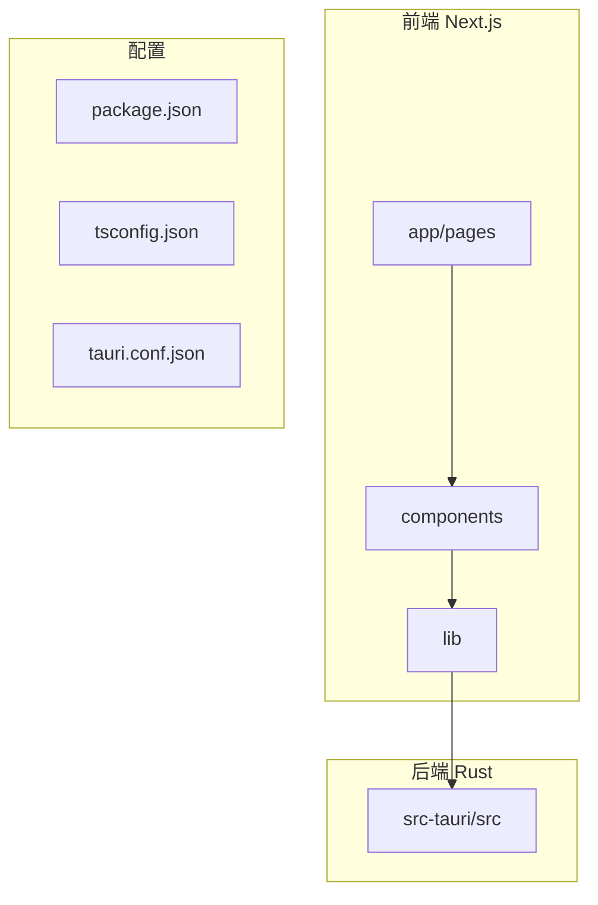
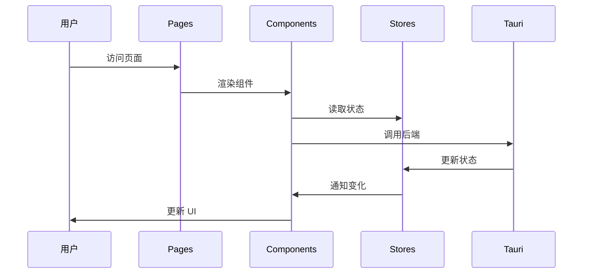

# 项目结构概览

本文档介绍 SkyMap 项目的整体结构和组织方式。

## 项目概览

SkyMap 是一个全栈桌面应用，结合了现代 Web 技术和 Rust 性能优势。



## 技术栈分层

### 表现层

- **Next.js 16**: 应用框架（App Router）
- **React 19**: UI 库
- **Tailwind CSS v4**: 样式
- **shadcn/ui**: UI 组件

### 业务层

- **Zustand**: 状态管理
- **Custom Hooks**: 自定义钩子（37+）
- **Services**: 业务逻辑

### 数据层

- **Tauri 2.9**: 桌面框架
- **Rust**: 后端逻辑
- **JSON 文件**: 数据存储
- **文件系统**: 缓存管理
- **Secret Vault**: 系统钥匙串

## 目录结构总览

```
cobalt-skymap/
├── app/                    # Next.js 页面和路由
├── components/             # React 组件
│   ├── ui/                # shadcn/ui 基础组件
│   ├── common/            # 共享组件（主题、语言、日志）
│   ├── icons/             # 品牌图标
│   └── starmap/           # 星图功能组件
│       ├── canvas/        # Stellarium 画布封装
│       ├── view/          # 主视图
│       ├── search/        # 搜索
│       ├── settings/      # 设置面板
│       ├── controls/      # 控制组件
│       ├── time/          # 时间控制
│       ├── overlays/      # FOV、卫星、标记叠加
│       ├── planning/      # 规划（高度图、曝光、计划）
│       ├── objects/       # 天体信息面板
│       ├── management/    # 管理器（设备、位置、缓存）
│       ├── knowledge/     # 每日天文知识
│       ├── mount/         # 赤道仪控制
│       ├── plate-solving/ # 解板工作流
│       └── map/           # 位置选择器
├── lib/                   # 工具库和业务逻辑
│   ├── astronomy/        # 天文计算
│   ├── stores/           # Zustand 状态管理（26+）
│   ├── services/         # 服务层
│   ├── tauri/            # Tauri API 封装
│   ├── hooks/            # React Hooks（37+）
│   ├── catalogs/         # 天文星表数据
│   ├── logger/           # 结构化日志系统
│   ├── storage/          # 存储抽象层
│   ├── cache/            # 缓存压缩、配置、迁移
│   └── ...               # core, constants, data, feedback, aladin, security
├── src-tauri/            # Rust 后端
│   └── src/             # Rust 源代码
│       ├── astronomy/   # 坐标变换、星历
│       ├── data/        # JSON 存储
│       ├── cache/       # 离线瓦片缓存、统一缓存
│       ├── network/     # HTTP 客户端、安全、速率限制
│       ├── platform/    # 应用设置、更新器、解板、密钥保险箱
│       └── mount/       # ALPACA 赤道仪客户端、模拟器
├── public/               # 静态资源
├── i18n/                # 国际化
└── docs/                # 项目文档
```

## 核心模块

### 1. 星图核心 (app/starmap/)

**职责**: 星图显示和交互

**关键文件**:
- `page.tsx`: 星图主页面
- `layout.tsx`: 星图布局
- `components/`: 星图组件

### 2. 组件库 (components/)

**职责**: 可复用的 UI 组件

**子模块**:
- `ui/`: 基础组件（button, dialog 等）
- `common/`: 共享组件（主题切换、语言选择、日志查看器）
- `icons/`: 品牌图标和 SkyMap logo
- `starmap/`: 星图功能组件（详见目录结构）

### 3. 工具库 (lib/)

**职责**: 业务逻辑和工具函数

**子模块**:
- `astronomy/`: 天文计算（坐标、时间、可见性、成像）
- `stores/`: 状态管理（26+ stores）
- `services/`: 服务层（搜索、地图、每日知识）
- `tauri/`: 后端 API 封装（天文、赤道仪、缓存、更新器等）
- `hooks/`: 自定义 React Hooks（37+）
- `logger/`: 结构化日志系统
- `cache/`: 缓存压缩、配置、迁移
- `plate-solving/`: 解板相关
- `security/`: 前端安全工具

### 4. 后端 (src-tauri/)

**职责**: 桌面应用功能

**主要模块**:
- `data/`: 数据持久化（storage, equipment, locations, targets, markers, observation_log）
- `astronomy/`: 天文计算和事件（calculations, events）
- `cache/`: 缓存系统（offline, unified）
- `network/`: 网络通信和安全（http_client, security, rate_limiter）
- `platform/`: 桌面特定功能（app_settings, app_control, updater, plate_solver, secret_vault）
- `mount/`: ALPACA 赤道仪客户端、模拟器、指令处理器

## 模块交互



## 代码规模

### 前端

- **页面**: ~15
- **组件**: 150+
- **Hooks**: 37+
- **Stores**: 26+
- **服务**: ~20

### 后端

- **Rust 模块**: 7 个主要模块（astronomy, data, cache, network, platform, mount）
- **Tauri 命令**: 150+
- **代码行数**: ~8000+ 行

## 开发工作流

### 前端开发

```bash
# 1. 创建组件
touch components/starmap/my-component.tsx

# 2. 创建 Store
touch lib/stores/my-store.ts

# 3. 在页面中使用
# app/starmap/page.tsx
```

### 后端开发

```bash
# 1. 创建 Rust 模块
touch src-tauri/src/my_module.rs

# 2. 在 lib.rs 中注册
# mod my_module;

# 3. 添加 Tauri 命令
# #[tauri::command]
```

## 文档结构

```
docs/
├── getting-started/      # 快速开始
├── user-guide/          # 用户指南
├── developer-guide/     # 开发指南
│   ├── architecture/    # 架构设计
│   ├── project-structure/  # 项目结构
│   ├── core-modules/    # 核心模块
│   └── apis/           # API 参考
└── reference/          # 参考资料
```

## 扩展项目

### 添加新功能

1. **前端功能**:
   - 在 `components/starmap/` 创建组件
   - 在 `lib/stores/` 创建状态
   - 在 `app/` 创建页面

2. **后端功能**:
   - 在 `src-tauri/src/` 创建模块
   - 在 `lib/tauri/` 封装 API
   - 在组件中调用

3. **文档更新**:
   - 更新用户指南
   - 更新 API 文档
   - 添加代码注释

## 相关文档

- [目录布局详解](directory-layout.md)
- [前端模块](frontend-modules.md)
- [后端模块](backend-modules.md)

---

返回：[项目结构](index.md)
