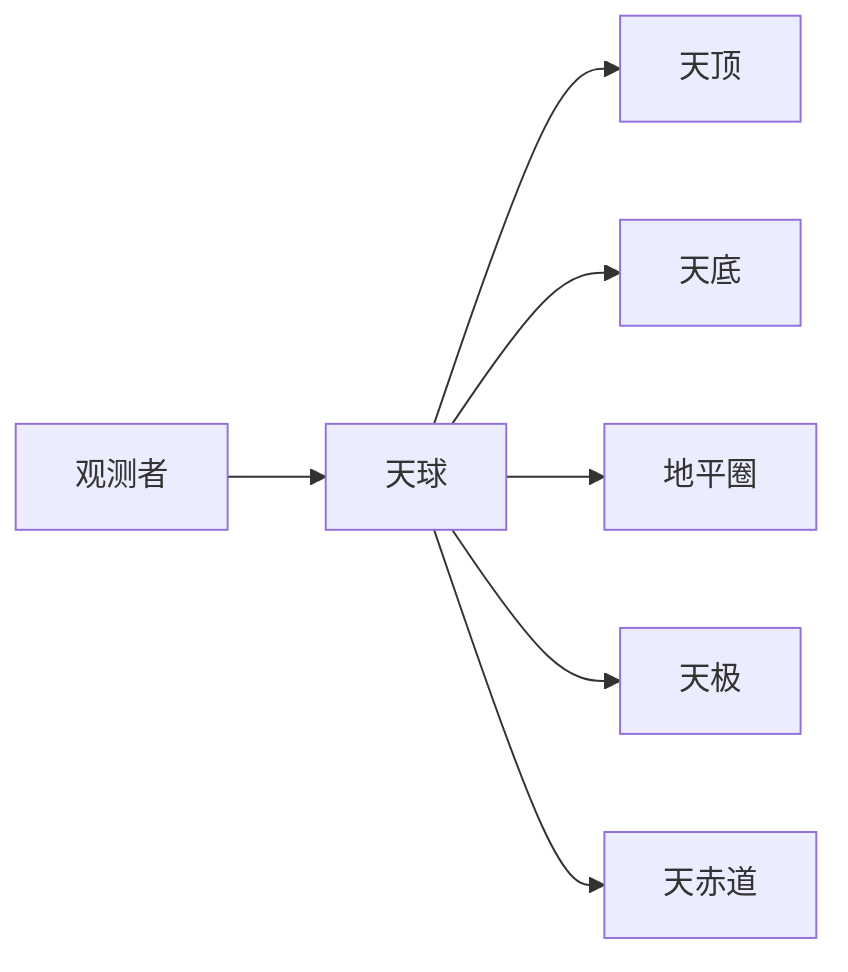

# 基本概念

本文档介绍使用 Cobalt Skymap 需要了解的天文学基本概念。

## 天球坐标系

### 什么是天球

天球是一个以观测者为球心的假想球体，所有天体都投影在这个球面上。天球是天文观测的基础概念。



### 地平坐标系

地平坐标系以观测者为基准，是最直观的坐标系统。

#### 主要元素

- **天顶**：观测者正上方的点，高度角 +90°
- **天底**：观测者正下方的点，高度角 -90°
- **地平圈**：天球与地平面相交的大圆
- **方位角 (Azimuth)**：从正北顺时针测量的角度（0°-360°）
- **高度角 (Altitude)**：从地平圈向上测量的角度（-90° 到 +90°）

#### 使用场景

- 肉眼观测与寻星镜定位
- 判断天体可见性
- 地平坐标随观测者位置变化，不适用于星表记录

### 赤道坐标系

赤道坐标系以天赤道为基准，是天文学中最重要的坐标系统，也是星表的标准坐标系。

#### 主要元素

- **天赤道**：地球赤道在天球上的投影
- **天极**：地球自转轴与天球的交点（北天极 / 南天极）
- **赤经 (Right Ascension, RA)**：沿天赤道从春分点向东测量的角度，用时、分、秒表示（0h-24h）
- **赤纬 (Declination, Dec)**：沿天球子午线测量的纬度（-90° 到 +90°）

#### 使用场景

- 星表和天文数据库
- 望远镜指向与跟踪
- 长期天文观测记录

### 坐标系转换

Cobalt Skymap 支持多种坐标系统之间的实时转换：

- 地平坐标 ↔ 赤道坐标
- 赤道坐标 ↔ 银河坐标
- 赤道坐标 ↔ 黄道坐标

内部使用统一的 ICRF/CIRS/OBSERVED 管线，附带 UTC/UT1/TT 元数据，确保转换精度。

## 时间系统

### 世界时 (UT)

世界时是基于地球自转的时间系统：

- **UT0**：原始观测的世界时
- **UT1**：修正极移后的世界时，用于精密天文计算
- **UTC**：协调世界时，使用跳秒保持与 UT1 接近

### 恒星时

恒星时基于地球相对于恒星的自转：

- **地方恒星时 (LST)**：观测者所在位置的恒星时，等于春分点的地方时角
- **格林尼治恒星时 (GST)**：格林尼治的恒星时

**关系**：

```
LST = GST + 东经（以小时为单位）
```

### 儒略日

儒略日是天文计算中常用的时间表示方法：

- 从公元前 4713 年 1 月 1 日正午开始连续计数
- 便于计算两个日期之间的时间间隔
- Cobalt Skymap 内部使用儒略日进行时间计算

### 其他时间尺度

- **TT (Terrestrial Time, 地球时)**：用于行星历表计算的均匀时间尺度
- **TAI (International Atomic Time)**：国际原子时

Cobalt Skymap 内置 EOP（地球定向参数）基线数据，即使离线也能保持高精度的时间与坐标转换。

## 天体坐标表示

### 赤经表示

赤经有两种表示方式：

1. **时角制**（推荐）
   - 格式：`12h 34m 56.7s` 或 `12:34:56.7`
   - 范围：0h - 24h
   - 1 小时 = 15 度

2. **度数制**
   - 格式：`188.73625°`
   - 范围：0° - 360°

Cobalt Skymap 搜索框支持直接输入坐标，如 `12h 30m +45°`。

### 赤纬表示

赤纬的标准表示：

- 格式：`+12° 34′ 56.7″` 或 `+12:34:56.7`
- 范围：-90° 到 +90°
- 北天极为 +90°，南天极为 -90°

## 天体运动

### 周日运动

由于地球自转，天体每天东升西落：

- **东天区天体**：从东方升起
- **西天区天体**：向西方落下
- **拱极天体**：永不落下（取决于观测者纬度，|Dec| > 90° - |纬度|）

### 周年运动

由于地球公转，天体位置在一年中逐渐变化：

- 太阳沿黄道运动
- 恒星的观测时间每天提前约 4 分钟
- 季节星空的变化

### 行星运动

行星相对于恒星的复杂运动：

- **顺行**：正常的由西向东运动
- **逆行**：暂时的由东向西运动
- **留**：顺行和逆行之间的转折点

## 星等和亮度

### 星等的定义

星等是天体亮度的度量：

- 数值越小，天体越亮
- 每差 5 个星等，亮度相差 100 倍
- 每差 1 个星等，亮度相差约 2.512 倍

### 星等类型

- **视星等**：天体在地球上的观测亮度
- **绝对星等**：天体在 10 秒差距处的亮度
- **摄影星等**：通过特定滤镜测量的亮度

### 常见天体星等

| 天体 | 视星等 |
|------|--------|
| 太阳 | -26.7 |
| 满月 | -12.7 |
| 金星（最亮） | -4.6 |
| 天狼星（最亮恒星） | -1.46 |
| 织女星 | 0.03 |
| 肉眼可见极限（暗空） | 约 6.0 |

## 观测条件

### 大气消光

地球大气会吸收和散射星光：

- 天顶方向消光最小
- 地平方向消光最大（约 3 个星等）
- 蓝光比红光消光更严重

### 大气折射

大气折射会使天体位置看起来升高：

- 天顶处折射为 0
- 地平处折射约 0.5°
- Cobalt Skymap 自动修正大气折射

### 光污染

光污染影响观测效果：

- 城市中心（Bortle 8-9）：极限星等约 3-4 等
- 郊区（Bortle 4-5）：极限星等约 5-6 等
- 暗空保护区（Bortle 1-2）：极限星等 7 等以上

### 视宁度

大气湍流影响图像清晰度：

- 以角秒为单位描述星像抖动
- 优秀：< 1″，良好：1-2″，一般：2-4″，差：> 4″

## 曙暮光

### 定义

曙暮光是日出前和日落后的天空变亮现象。

### 类型

| 类型 | 太阳高度 | 特征 |
|------|----------|------|
| **民用曙暮光** | 地平下 0°-6° | 天空仍较亮，肉眼可辨地平 |
| **航海曙暮光** | 地平下 6°-12° | 地平线已不可辨，但亮星可见 |
| **天文曙暮光** | 地平下 12°-18° | 天空完全黑暗，适合深空观测 |

### 观测意义

- 天文曙暮光结束时才开始真正的夜间深空观测
- Cobalt Skymap 自动计算并显示各类曙暮光时间

## 下一步

了解这些基本概念后，您可以：

1. 阅读[功能导览](quick-tour.md)了解应用功能
2. 查看[用户指南](../user-guide/index.md)学习具体操作
3. 深入学习[天文学基础](../reference/astronomy-basics/index.md)

## 参考资料

- [天文学基础](../reference/astronomy-basics/index.md)
- [术语表](../reference/glossary.md)
- [坐标系统详细说明](../reference/astronomy-basics/coordinates.md)
