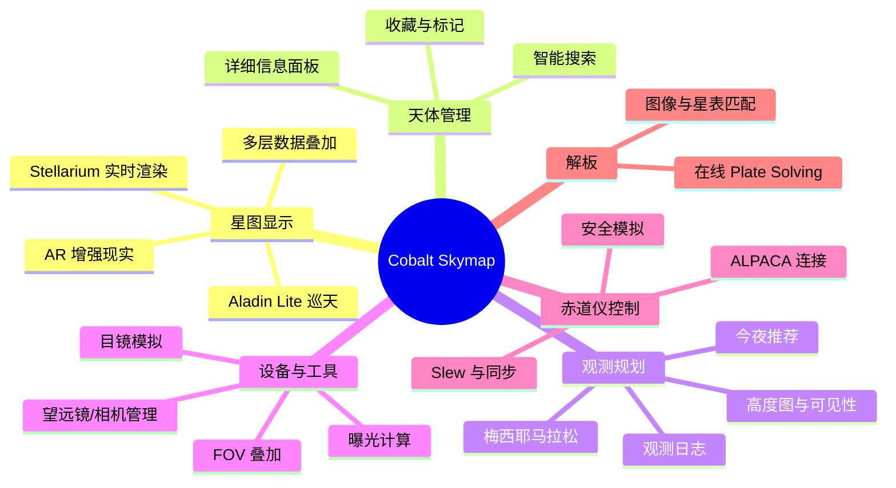

# 功能导览

本文档快速介绍 Cobalt Skymap 的主要功能。

## 入门引导流程

首次进入星图页面时，应用会引导您完成初始配置：

1. **欢迎弹窗** — 简介与应用概览
2. **设置向导** — 位置、设备配置（可跳过）
3. **核心导览** — 星图基本操作介绍
4. **模块导览中心** — 按需进入各功能模块的专题导览

专题导览涵盖以下模块：

- **搜索与发现** — 天体搜索、今夜推荐、星图图集、导航历史、视角书签
- **观测规划** — 会话规划、天文事件、计算器、观测日志、标记与位置
- **摄影工具** — FOV 计算、曝光建议、拍摄清单、设备管理、解板、目镜模拟
- **控制与显示** — 缩放、位置、卫星、赤道仪、主题/语言/夜视
- **设置与帮助** — 设置面板、快捷键、关于页面
- **高级功能** — 解板、卫星追踪、赤道仪控制、目镜模拟、高级计算

## 主要功能概览

## 1. 星图显示功能

### 实时星图渲染

- **动态星图**：实时显示当前星空，支持时间暂停、加速、倒流
- **双引擎切换**：在 Stellarium Web Engine 与 Aladin Lite 之间自由切换
- **AR 模式**：将天球叠加到摄像头画面，辅助现场寻星
- **平滑动画**：流畅的天体运动与时间变化效果

### 多层星图数据

支持的星图图层：

- 恒星层（HIPPARCOS、Tycho 等）
- 深空天体层（M、NGC、IC 等）
- 太阳系天体（太阳、月亮、行星）
- 人造卫星（需网络连接）
- 自定义标记层
- FOV 叠加层（显示相机/目镜视场）

### 交互控制

- **鼠标操作**：拖动旋转视角、滚轮缩放、右键平移
- **键盘快捷键**：方向键旋转、`+/-` 缩放、`T` 返回当前时间、`Space` 暂停
- **触摸手势**：单指拖动、双指捏合缩放

### 辅助显示

- 坐标网格（地平、赤道、银河、黄道）
- 星座图案、边界、名称
- 参考线（黄道、银河、天赤道）
- 方位标记（东、南、西、北、天顶）

## 2. 天体管理功能

### 天体搜索

快速查找天体：

- **智能搜索**：支持模糊匹配与多语言
- **多种编号**：梅西耶、NGC、IC 等编号系统
- **坐标搜索**：直接输入赤经赤纬（如 `12h 30m +45°`）
- **历史记录**：保存搜索历史

### 详细信息

查看天体的详细信息：

- **基本数据**：坐标、星等、大小
- **物理性质**：距离、类型、亮度
- **可见性**：当前和未来的升起/落下时间
- **图像**：Deep Sky Survey 图像
- **高度图**：目标在夜间的轨迹曲线

### 收藏与标记

管理常用天体：

- **添加收藏**：将感兴趣的天体加入收藏
- **天空标记**：在星图上任意位置添加自定义标记
- **视图书签**：保存当前视角，一键返回

## 3. 观测规划功能

### 今夜推荐

系统根据当前条件自动推荐最佳观测目标：

- 根据位置和时间计算目标可见性
- 考虑月相和天气条件
- 按摄影/目视/混合模式评分排序
- 一键添加到目标列表

### 高度图与可见性

可视化目标在夜间的高度变化：

- 实时高度曲线
- 子午线标记与最佳观测窗口
- 薄暮时段显示
- 多目标对比

### 梅西耶马拉松

专为 Messier Marathon 设计的完整工作流：

- 自动生成按最优顺序排列的 110 个目标
- 执行过程中标记完成状态
- 自动跳转到下一个目标

### 观测日志

结构化记录每次观测 session：

- 记录目标、设备、环境条件
- 添加观测笔记与评分
- 关联到计划器执行摘要

## 4. 设备与摄影工具

### 设备管理

配置和管理观测设备：

- **望远镜**：焦距、口径、类型（折射/反射/折反射）
- **相机**：传感器尺寸、像素大小、分辨率
- **目镜与附件**：焦距、视场角、增倍镜/缩倍镜、滤镜
- **设备组合**：快速切换不同的望远镜+相机配置

### FOV 计算与叠加

在星图上实时显示视场范围：

- 根据设备参数计算 FOV 大小
- 在星图上以矩形/圆形框显示
- 支持旋转角度预览
- 构图辅助

### 曝光计算器

天文摄影曝光参数计算：

- 基于目标亮度、焦比、传感器性能
- 考虑天光质量（Bortle 等级）
- 给出信噪比估算与最佳曝光时间建议
- 叠加帧数建议

### 目镜模拟

模拟不同目镜或相机传感器下的实际视场效果，帮助在观测前预览目标在视场中的大小和位置。

## 5. 赤道仪控制

### ALPACA 连接

连接与控制支持 ALPACA 协议的赤道仪：

- 输入 ALPACA 设备地址
- 实时状态轮询（坐标、跟踪状态、穿刺侧）
- Slew 到指定目标
- 同步与对准

### 安全模拟

在 slew 前模拟运行轨迹：

- 检查子午线翻转时机
- 排查时角限制
- 预判立柱碰撞风险

## 6. 在线解板（Plate Solving）

将您的天文照片与星表匹配：

1. 上传 FITS 或 JPEG 图像
2. 选择在线解板服务
3. 等待匹配完成
4. 查看精确坐标、旋转角与视场大小
5. 在星图上定位对应区域

## 7. 离线功能

### 数据缓存

- 自动缓存浏览过的星图瓦片
- 手动下载特定区域的数据
- 缓存管理器查看和清理缓存

### 离线模式

- 使用缓存数据显示星图
- 离线进行天文计算（内置 EOP 基线保证精度）
- 联网后自动更新数据

## 8. 每日天文知识

启动时呈现的精选天文科普内容：

- 近期天象预告
- 天体科普知识
- 天文历史事件

## 典型使用场景

### 场景 1：今晚观测什么

1. 打开应用，确认观测位置和时间
2. 查看「今夜推荐」面板
3. 浏览推荐目标的高度图与可见性
4. 将感兴趣的目标添加到观测列表
5. 查看详细信息与 FOV 预览

### 场景 2：规划深空摄影

1. 选择摄影目标
2. 配置设备（望远镜、相机）
3. 使用 FOV 叠加确认构图
4. 使用曝光计算器获取建议参数
5. 确定最佳拍摄时间窗口
6. 制定拍摄计划并关联到观测日志

### 场景 3：现场辅助寻星

1. 开启 AR 模式（可选）
2. 搜索目标天体
3. 查看当前高度与方位
4. 连接赤道仪并 slew 到目标
5. 使用解板功能微调精确指向

### 场景 4：梅西耶马拉松

1. 在观测规划中选择「梅西耶马拉松」
2. 设置观测日期
3. 按推荐顺序依次观测
4. 标记完成状态，自动推进到下一个目标

## 下一步

完成功能导览后，您可以：

1. 深入学习[用户指南](../user-guide/index.md)
2. 阅读[开发指南](../developer-guide/index.md)
3. 查看具体功能的详细文档

## 需要帮助？

- 查看[常见问题](../reference/faq.md)
- 阅读[故障排除](../reference/troubleshooting.md)
- 访问社区论坛
