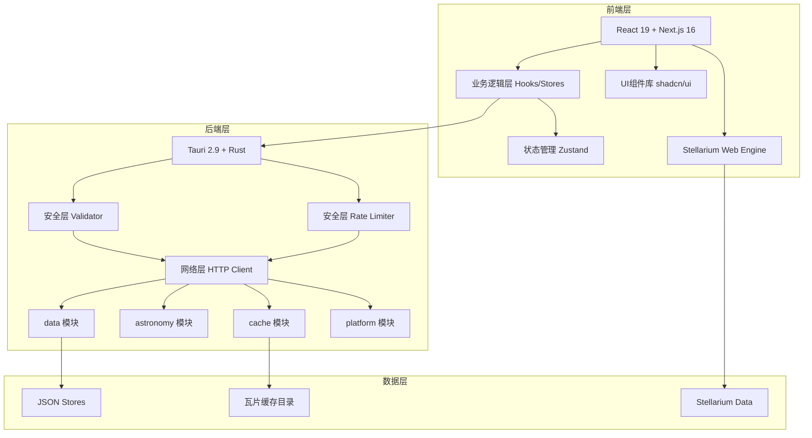

# SkyMap

## 项目简介

SkyMap 是一款功能强大的天文观测桌面应用程序，专为天文爱好者和业余天文学家设计。它提供了专业的星图显示、精确的天文计算、完善的设备管理以及智能的观测规划功能。

## 核心特性

### 专业的星图显示

- 实时渲染的交互式星图（集成 Stellarium Web Engine）
- 支持多种星图 survey（DSS, SDSS, AKARI 等）
- 精确的天体位置计算（基于 custom Astro logic）
- 支持自定义星表和数据源

### 智能观测规划

- 天体可见性预测与高度图
- 曙暮光时间计算与天文观测窗口
- 天文事件预报（日月食、行星合等）
- 目标列表管理与收藏
- 最佳观测时间推荐

### 完善的设备管理

- 望远镜配置和管理
- 相机参数设置（传感器、像素大小等）
- 附件管理（目镜、增倍镜/缩倍镜、滤镜）
- 视野 (FOV) 计算与预览

### 强大的天文摄影工具

- 视野计算器与取景器预览
- 曝光时间建议工具
- 构图辅助与旋转角度预览

### 离线工作支持

- 本地缓存星图瓦片数据
- 离线模式支持
- 智能缓存容量管理
- 统一的持久化存储系统（JSON 存储）

### 安全防护

- 速率限制（滑动窗口算法）
- 输入验证（大小限制、格式校验）
- SSRF 防护（URL 验证、私有 IP 拦截）
- 存储安全（路径沙箱）

### 跨平台支持

- Windows、macOS、Linux (Tauri 2.9)
- 基于现代 Web 技术栈 (Next.js 16 + React 19)
- 原生桌面集成（文件关联、系统通知等）

## 技术架构

### 前端技术栈

- **Next.js 16** - React 框架 (App Router)
- **React 19** - UI 库
- **TypeScript** - 类型安全
- **Tailwind CSS v4** - 样式框架
- **shadcn/ui** - UI 组件库
- **Zustand** - 状态管理
- **next-intl** - 国际化 (i18n)

### 后端技术栈

- **Tauri 2.9** - 桌面应用框架 (Rust)
- **Rust** - 系统编程语言
- **JSON File Storage** - 本地数据持久化存储
- **Security Layer** - 输入验证、速率限制与安全检查

## 系统架构图



## 快速开始

### 安装

```bash
# 克隆仓库
git clone https://github.com/ElementAstro/cobalt-skymap.git
cd cobalt-skymap

# 安装依赖
pnpm install
```

### 运行

```bash
# Web 开发模式
pnpm dev

# 桌面应用开发模式
pnpm tauri dev
```

### 构建

```bash
# 构建 Web 应用 (Static Export)
pnpm build

# 构建桌面应用
pnpm tauri build
```

## 文档导航

### 用户指南

- **[快速开始](getting-started/index.md)** - 快速上手指南
- **[用户手册](user-guide/index.md)** - 详细功能说明

### 开发者指南

- **[开发指南](developer-guide/index.md)** - 开发文档
- **[API 参考](developer-guide/apis/index.md)** - API 文档
- **[架构设计](developer-guide/architecture/index.md)** - 系统架构
- **[数据管理](developer-guide/data-management/index.md)** - 数据管理系统
- **[安全开发](developer-guide/security/index.md)** - 安全开发指南

### 部署指南

- **[部署指南](deployment/index.md)** - 部署文档

### 安全

- **[安全特性](security/security-features.md)** - 安全功能说明

### 参考资料

- **[天文学基础](reference/astronomy-basics/index.md)** - 天文学知识
- **[术语表](reference/glossary.md)** - 专业术语解释
- **[常见问题](reference/faq.md)** - 常见问题解答

## 社区与支持

- **GitHub**: [https://github.com/ElementAstro/cobalt-skymap](https://github.com/ElementAstro/cobalt-skymap)
- **问题反馈**: [GitHub Issue 表单](https://github.com/ElementAstro/cobalt-skymap/issues/new)
- **讨论区**: [GitHub Discussions](https://github.com/ElementAstro/cobalt-skymap/discussions)
- **诊断附件流程**: 建议先在应用内反馈对话框下载诊断包，再在 Issue 页面手动上传附件

## 许可证

[MIT License](LICENSE)

---
**开始使用**: [快速开始指南](getting-started/index.md)

