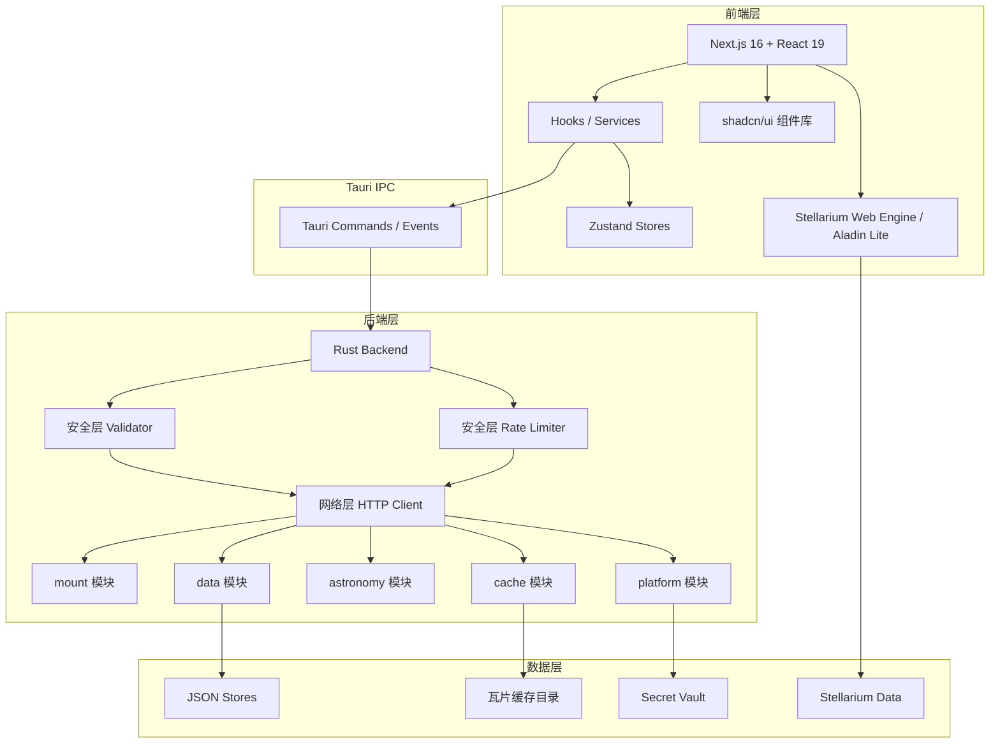

# Cobalt Skymap

## 项目简介

Cobalt Skymap 是一款面向天文爱好者与业余天文学家的现代化桌面星图与观测规划软件。它集成了 Stellarium Web Engine 实现专业级星空渲染，同时提供完备的天文计算、设备管理与观测规划能力，覆盖从「找星」到「出摊」的完整 workflow。

## 核心特性

### 星空可视化

- **Stellarium Web Engine** — 实时交互式星图渲染，精准呈现恒星、星座与深空天体
- **Aladin Lite 双引擎** — 一键切换至 Aladin Lite，浏览多波段巡天数据与 FITS 图像叠加
- **AR 模式** — 将天球实时叠加到相机画面，沉浸式辅助寻星
- **天空标记与书签** — 自定义标记并保存常用视角，快速定位
- **卫星追踪** — 实时追踪人造卫星与空间碎片

### 观测规划

- **观测计划** — 高度图、可见性窗口与最佳观测时机推荐
- **目标推荐** — 针对摄影、目视及混合观测的自适应评分与置信度提示
- **梅西耶马拉松** — 专为 Messier Marathon 设计的完整工作流
- **观测日志** — 结构化记录每次观测 session
- **赤道仪安全模拟** — 在 slew 前模拟 GEM 运行轨迹，排查子午线翻转与立柱碰撞风险

### 设备与工具

- **设备管理** — 配置望远镜、相机与目镜，实时叠加 FOV
- **在线解板（Plate Solving）** — 图像与星表匹配，快速获取精确指向
- **赤道仪控制** — 支持 ALPACA 协议，实时状态轮询与 slew 指令
- **曝光计算器** — 根据天光质量与器材参数给出曝光建议
- **目镜模拟** — 模拟不同目镜或传感器下的实际视场

### 天文计算引擎

- **统一计算引擎** — Rust 后端优先，纯 JS 回退，桌面与 Web 结果一致
- **天文计算器** — 九大标签页：今夜可见、位置、升落 transit、星历、年历、天象、坐标转换、时间、太阳系
- **坐标管线** — 统一 ICRF/CIRS/OBSERVED 参考架，附带 UTC/UT1/TT 元数据
- **离线精度** — 内置 EOP 基线，联网后台增量更新
- **每日天文知识** — 精选天文科普与近期天象，启动时呈现

### 界面与无障碍

- **现代化界面** — Tailwind CSS v4 + Geist 字体，深色模式与主题工作台
- **无障碍组件** — 基于 Radix UI 的 shadcn/ui，全面支持键盘导航
- **夜视模式** — 红光滤镜保护暗适应
- **多语言** — 简体中文与英文
- **自动更新** — 桌面端内置更新机制

### 安全防护

- **速率限制** — 滑动窗口算法防止 API 滥用
- **输入校验** — JSON、CSV、瓦片数据大小限制
- **SSRF 防护** — URL 校验拦截私有 IP 与危险协议
- **存储安全** — 路径沙箱防止目录遍历
- **密钥保险箱** — 通过系统钥匙串安全存储 API 密钥等敏感凭证

## 技术架构

### 前端

- **Next.js 16** — React 框架（App Router）
- **React 19** — UI 库
- **TypeScript** — 类型安全
- **Tailwind CSS v4** — 样式框架
- **shadcn/ui** — 基于 Radix UI 的组件库
- **Zustand** — 状态管理
- **next-intl** — 国际化

### 后端

- **Tauri 2.9** — 桌面应用框架（Rust）
- **Rust** — 系统编程语言
- **JSON File Storage** — 本地数据持久化
- **Secret Vault** — 系统钥匙串集成

## 系统架构图



## 快速开始

### 安装

```bash
# 克隆仓库
git clone https://github.com/ElementAstro/cobalt-skymap.git
cd cobalt-skymap

# 安装依赖
pnpm install
```

### 运行

```bash
# Web 开发模式
pnpm dev

# 桌面应用开发模式
pnpm tauri dev
```

### 构建

```bash
# 构建 Web 应用（静态导出）
pnpm build

# 构建桌面应用
pnpm tauri build

# 预配置桌面构建
pnpm build:desktop
```

## 文档导航

### 用户指南

- **[快速开始](getting-started/index.md)** — 安装、首次配置与功能导览
- **[用户手册](user-guide/index.md)** — 详细功能说明

### 开发者指南

- **[开发指南](developer-guide/index.md)** — 环境搭建、模块结构与编码规范
- **[API 参考](developer-guide/apis/index.md)** — 前后端 API 文档
- **[架构设计](developer-guide/architecture/index.md)** — 系统架构与数据流
- **[安全开发](developer-guide/security/index.md)** — 安全最佳实践

### 部署指南

- **[部署指南](deployment/index.md)** — 桌面与 Web 构建、签名与分发

### 安全

- **[安全特性](security/security-features.md)** — 安全机制详解

### 参考资料

- **[天文学基础](reference/astronomy-basics/index.md)** — 天文学知识
- **[术语表](reference/glossary.md)** — 专业术语解释
- **[常见问题](reference/faq.md)** — 常见问题解答

## 社区与支持

- **GitHub**: [https://github.com/ElementAstro/cobalt-skymap](https://github.com/ElementAstro/cobalt-skymap)
- **问题反馈**: [GitHub Issues](https://github.com/ElementAstro/cobalt-skymap/issues/new)
- **讨论区**: [GitHub Discussions](https://github.com/ElementAstro/cobalt-skymap/discussions)

如需提供诊断信息，建议在应用内反馈对话框下载诊断包，再在 Issue 页面手动上传附件。

## 许可证

[MIT License](LICENSE)

---
**开始使用**: [快速开始指南](getting-started/index.md)
